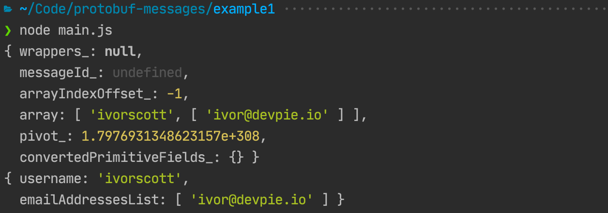

# Protobuf messages

## What is Protobuf

Protocol Buffers (Protobuf) is a method of serializing structured data.
Useful for quickly and efficiently communicating between cross-platform programs over a network or for storing data.

The method involves an interface description language that describes the structure of some data 
and a program that generates source code from that description for generating or parsing a stream 
of bytes that represents the structured data.

## Advantages
- Data is fully typed
- Data is compressed automatically (less CPU usage)
- Schema (defined using .proto file) is needed to generate code and read the data
- Documentation can be embedded in the schema
- Data can be read across many languages (Go, Python, JavaScript, Java, C#, etc.)
- Schema can evolve safely over time
- 3-10x smaller, 20-100x faster than XML
- Code generation
 
## Disadvantages
- Protobuf support might be lacking for less popular languages
- Serialized data can't be read in a text editor
 
### How To Guide (JavaScript)

1. Install [protoc](https://github.com/protocolbuffers/protobuf/releases/tag/v3.14.0) binary. 

2. Install google's protobuf package for javascript.

    ```
    npm i google-protobuf
    ```

3. Create a file named `messages.proto`.

    ```proto
    syntax = "proto3";
    
    message Customer {
      string username = 1;
      repeated string email_addresses = 2; // array of strings
    }
    ```
4. Generate code that supports commonjs and binary strings.

    ```bash
    protoc --js_out=import_style=commonjs,binary:. messages.proto  
    ```

5. Using the generated code.

    ```js
    var messages = require('./messages_pb');
    
    // the message is preconfigured to be able to serialize
    var customer = new messages.Customer()
    
    customer.setUsername('ivorscott');
    customer.getEmailAddressesList().push('ivor@devpie.io');
    
    console.log(customer)
    console.log(customer.toObject())
    ```
   